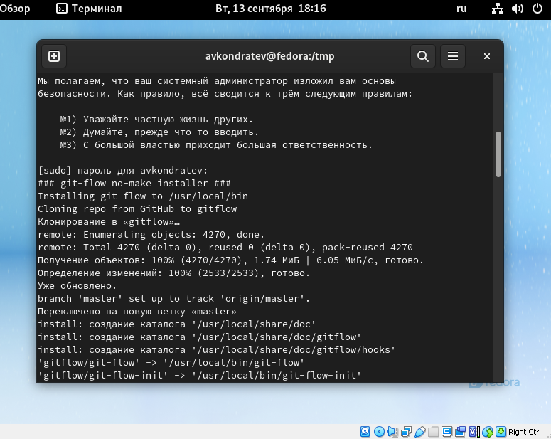
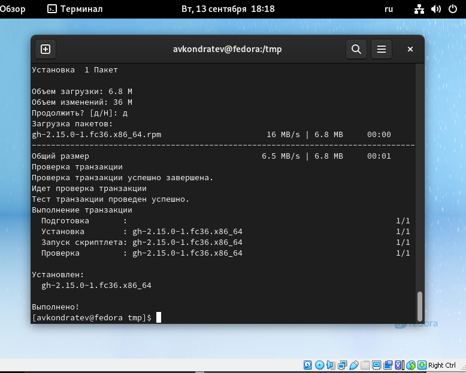
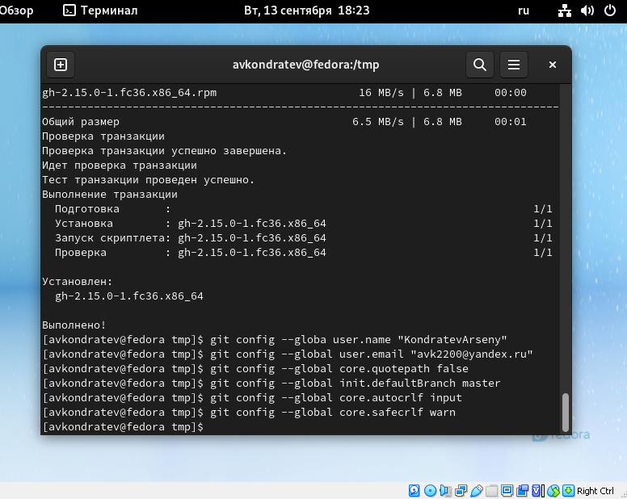
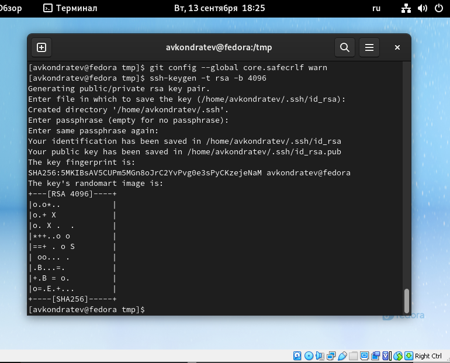
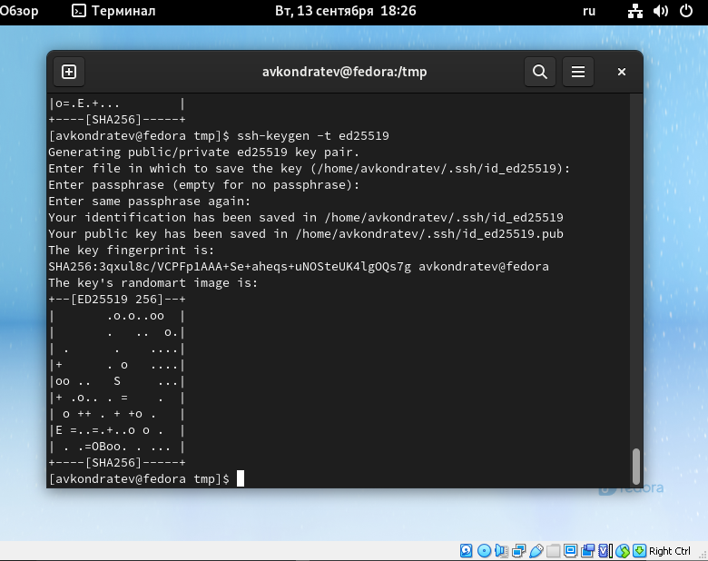
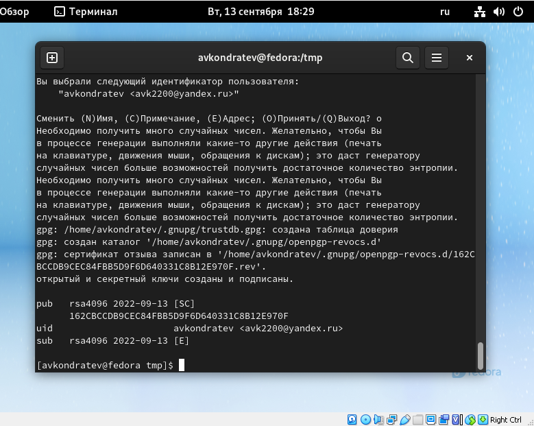
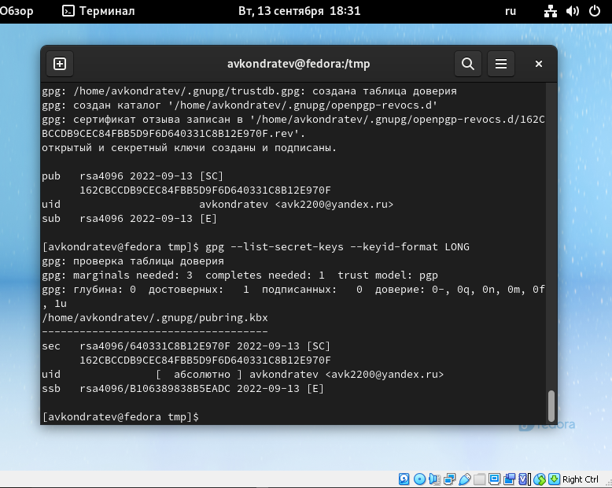
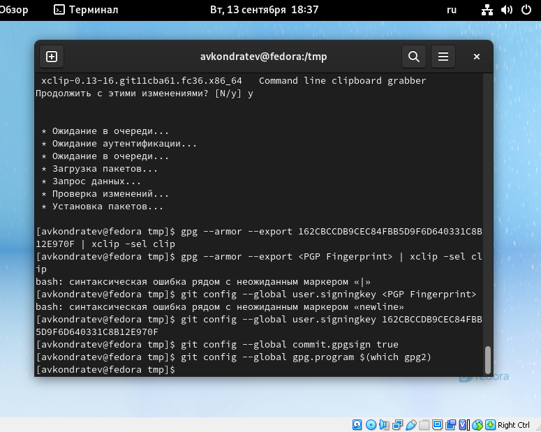
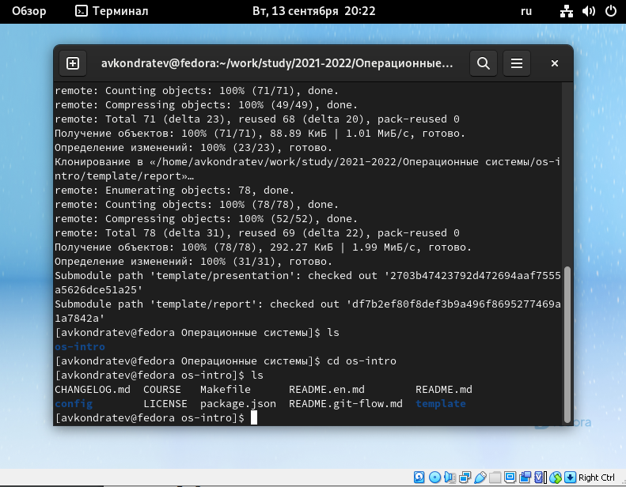
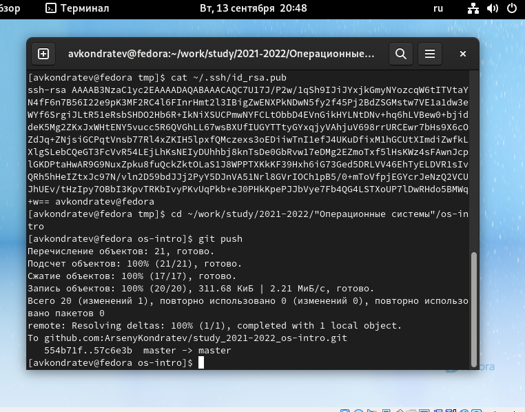

---
## Front matter
lang: ru-RU
title: "Лабораторная работа №3"
subtitle: "Дисциплина: Операционные системы"
author: "Кондратьев Арсений Вячеславович"
institute: "Российский университет дружбы народов, Москва, Россия"
date: 14.09.2022

## Generic otions
lang: ru-RU
toc-title: "Содержание"

## Bibliography
bibliography: bib/cite.bib
csl: pandoc/csl/gost-r-7-0-5-2008-numeric.csl

## Pdf output format
toc: true # Table of contents
toc-depth: 2

fontsize: 12pt
linestretch: 1.5
papersize: a4
documentclass: scrreprt
## I18n polyglossia
polyglossia-lang:
  name: russian
  options:
	- spelling=modern
	- babelshorthands=true
polyglossia-otherlangs:
  name: english
## I18n babel
babel-lang: russian
babel-otherlangs: english
## Fonts
mainfont: PT Serif
romanfont: PT Serif
sansfont: PT Sans
monofont: PT Mono
mainfontoptions: Ligatures=TeX
romanfontoptions: Ligatures=TeX
sansfontoptions: Ligatures=TeX,Scale=MatchLowercase
monofontoptions: Scale=MatchLowercase,Scale=0.9
## Biblatex
biblatex: true
biblio-style: "gost-numeric"
biblatexoptions:
  - parentracker=true
  - backend=biber
  - hyperref=auto
  - language=auto
  - autolang=other*
  - citestyle=gost-numeric


## Misc options
indent: true
header-includes:
  - \usepackage{indentfirst}
  - \usepackage{float} # keep figures where there are in the text
  - \floatplacement{figure}{H} # keep figures where there are in the text
---

# Цель работы

Научиться оформлять отчёты с помощью легковесного языка разметки Markdown.

# Задание

Сделайте отчёт по предыдущей лабораторной работе в формате Markdown.

В качестве отчёта просьба предоставить отчёты в 3 форматах: pdf, docx и md (в архиве,
поскольку он должен содержать скриншоты, Makefile и т.д.)


# Теоретическое введение
## Основные команды git

git init

git pull

git push

git status

git diff

git add

git rm

git commit

git checkout -b имя_ветки


# Выполнение лабораторной работы

1.	Создал учетную запись на Github(рис.[-@fig:001])

 { #fig:001 width=70% }
 
2. Установил Git-flow(рис.[-@fig:002])

``` bash
cd /tmp
wget --no-check-certificate -q https://raw.github.com/petervanderdoes 
↪ /gitflow/develop/contrib/gitflow-installer.sh 
chmod +x gitflow-installer.sh 
sudo ./gitflow-installer.sh install stable
```

 { #fig:002 width=70% }
 
3. Установил gh в Fedora Linux(рис.[-@fig:003])

``` bash
sudo dnf install gh
```
    
 { #fig:003 width=70% }
 
4. Выполнил базовую настройку Git(рис.[-@fig:004])

``` bash
git config --global user.name "KondratevArseny"
git config --global user.email avk2200@yandex.ru
git config --global core.quotepath false
git config --global init.defaultBranch master
git config --global core.autocrlf input > git config --global core.safecrlf warn
```

 { #fig:004 width=70% }
 
5. Создал ключ SSH по алгоритму rsa(рис.[-@fig:005])

``` bash
ssh-keygen -t rsa -b 4096
```

 { #fig:005 width=70% }
 
6. Создал ключ SSH по алгоритму ed25519(рис.[-@fig:006])

``` bash
ssh-keygen -t ed25519
```

 { #fig:006 width=70% }
 
7.	Создал ключи pgp(рис.[-@fig:007])

``` bash
gpg --full-generate-key
```

 { #fig:007 width=70% }
 
8. Добавил ключ pgp в github(рис.[-@fig:008], рис.[-@fig:009])

``` bash
gpg --armor --export <PGP Fingerprint> | xclip -sel clip
```

 { #fig:008 width=70% }

 { #fig:009 width=70% }
 
9. Настроил автоматические подписи коммитов git(рис.[-@fig:010])

``` bash
git config --global user.signingkey <PGP Fingerprint>
git config --global commit.gpgsign true
git config --global gpg.program $(which gpg2)
```

 { #fig:010 width=70% }
 
10. Создал репозиторий курса на основе шаблона(рис.[-@fig:011])

``` bash
mkdir -p ~/work/study/2021-2022/"Операционные системы"
cd ~/work/study/2021-2022/"Операционные системы"
gh repo create study_2021-2022_os-intro
↪ --template=yamadharma/course-directory-student-template --public
git clone --recursive
↪ git@github.com:ArsenyKondratev study_2021-2022_os-intro.git os-intro
```

 { #fig:011 width=70% }
 
11. Настроил каталог курса(рис.[-@fig:012])

Удалил лишние файлы и создал необходимый каталог

``` bash
rm package.json
make COURSE=os-intro
```

 { #fig:012 width=70% }
 


# Выводы

Я научился оформлять отчёты с помощью легковесного языка разметки Markdown.

# Контрольные вопросы

1.	Система контроля версий (Version Control System, VCS) — программное обеспечение для облегчения работы с изменяющейся информацией.
VCS позволяет хранить несколько версий одного и того же документа, при необходимости возвращаться к более ранним версиям, определять, кто и когда сделал то или иное изменение.
2.	Хранилище – место, где хранятся изменения кода.
Commit - снимок состояния проекта на текущий момент времени.
История – список снимков состояния проекта к которым можно при необходимости откатиться.
Рабочая копия - Рабочая копия является снимком одной версии проекта.
3.	Централизованные системы контроля версий представляют собой приложения типа клиент-сервер, когда репозиторий проекта существует в единственном экземпляре и хранится на сервере.(CVS, Subversion)
Децентрализованные системы контроля версий (Distributed Version Control System, DVCS) позволяют хранить репозиторий (его копию) у каждого разработчика, работающего с данной системой.(Git, Mercurial)
 
4.	Создаем свою ветку, базирующуюся на главной(git checkout -b имя_ветки), вносим изменения, делаем снимок(git commit) и затем вносим эти изменения в свою ветку(git push)
5.	Отдельные ветки разработчиков внедряются в общую master ветку
6.	Git позволяет несокльким разработчикам с удобством работать над одним проектом. Возможность получать изменения, внесенные другим человеком и откатываться на прошлые версии в случае ошибок.
7.	
a.	создание основного дерева репозитория – git init
b.	получение обновлений (изменений) текущего дерева из центрального репозитория – git pull
c.	отправка всех произведённых изменений локального дерева в центральный репозиторий – git push
d.	просмотр списка изменённых файлов в текущей директории – git status
e.	просмотр текущих изменений – git diff
f.	добавить все изменённые и/или созданные файлы и/или каталоги – git add
g.	сохранить все добавленные изменения и все изменённые файлы – git commit
h.	создание новой ветки, базирующейся на текущей: - git checkout -b имя_ветки
i.	переключение на некоторую ветку - git checkout имя_ветки
j.	слияние ветки с текущим деревом - git merge --no-ff имя_ветки
k.	удаление локальной уже слитой с основным деревом ветки - git branch -d имя_ветки
l.	принудительное удаление локальной ветки - git branch -D имя_ветки
8.	С локальным: commit(снимок состояния проекта) 
С удаленным: push(отправляем изменения) pull(загружаем изменения)
9.	Это простой перемещаемый указатель на один из таких коммитов. Они нужны для того, чтобы разделять код. Например одна ветка у нас может быть основная для разработки. Если мы делаем новый функционал, то мы создаем новую ветку под него, а после окончания работы сливаем то, что мы сделали в основную ветку.
10.	Во время работы могут появляться временные файлы, не несущие смысла для проекта. Их лучше не отправлять при использовании commit.


::: {#refs}
:::
